## 目录

[计算机课程所需教程](#计算机课程所需教程)

[非专业相关书籍](#非专业相关书籍)

[专业相关书籍](#专业相关书籍)

点击上述链接可以跳转到相应位置。交易地点在一栋楼下，送货上门需要跑腿费(请原谅一个懒惰的死肥宅)

## 计算机课程所需教程

1. 算法导论  九成新  15元

   

2. 数据库实用教程 七成新 15元  (已出)

   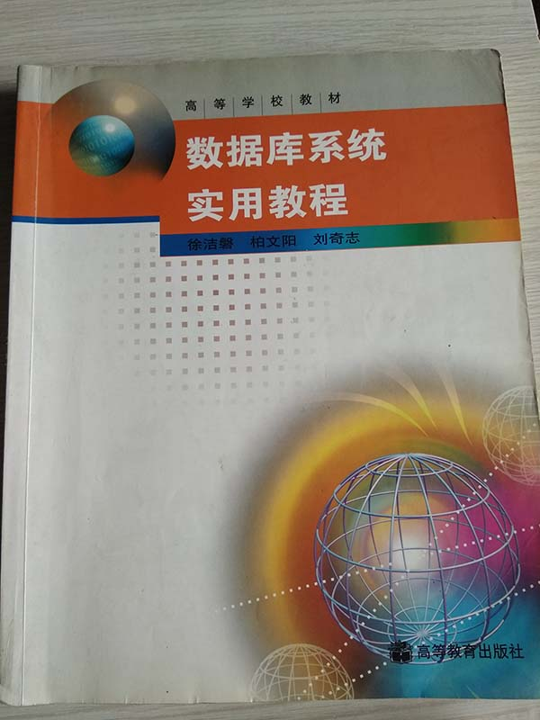

3. 大学数学典型题解析  七成新 10元

   

4. 数字设计原理与实践 八成新 15元

   

5. 离散数学及其应用	八成新	15元

   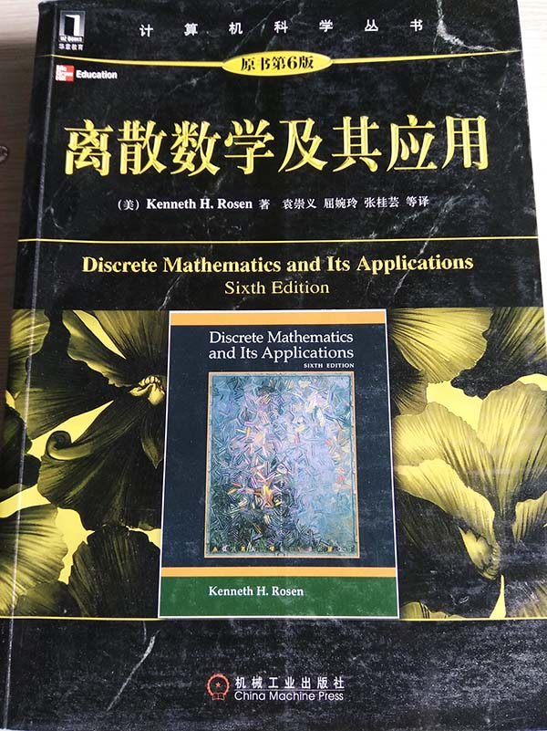

6. 软件工程实践者的研究方法	八成新	10元

   

7. 数据挖掘概念和技术	八成新	15元

   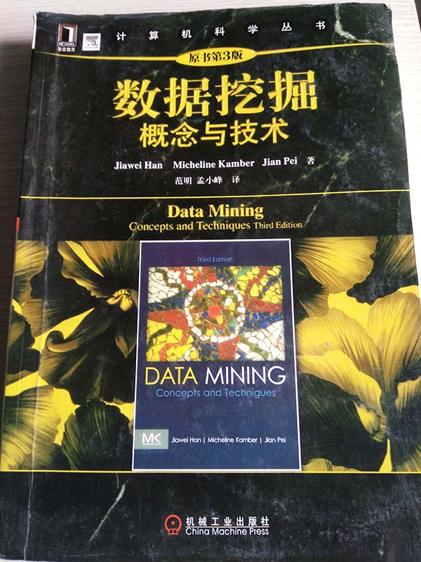

8. 软件测试的概念和方法	八成新	8元

   

9. 计算机图形学教程	九成新	12元  (已出)

   

10. 计算机系统基础	八成新	8元  (已出)

    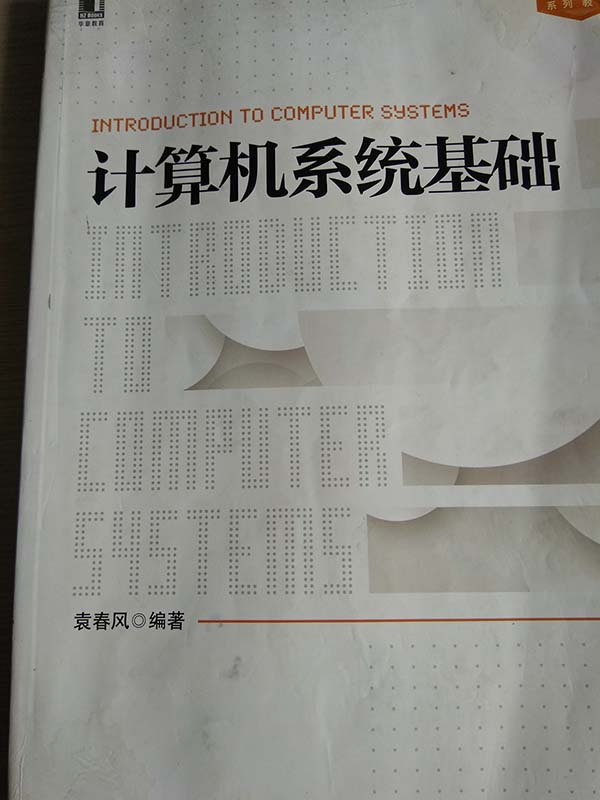

11. 程序设计教程	六成新	10元

    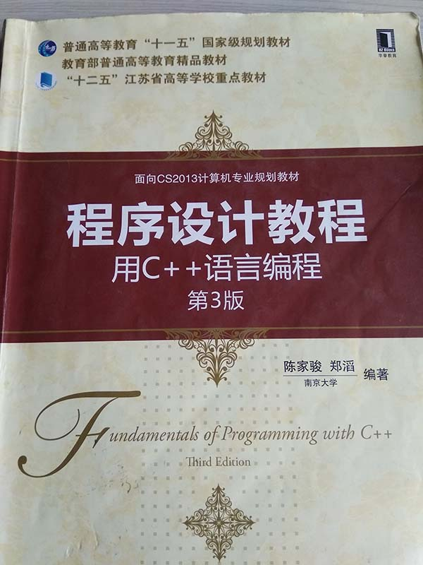

12. 机器学习	八成新	8元  (已出)

    

13. 计算机网络	七成新	15元  (已出)

    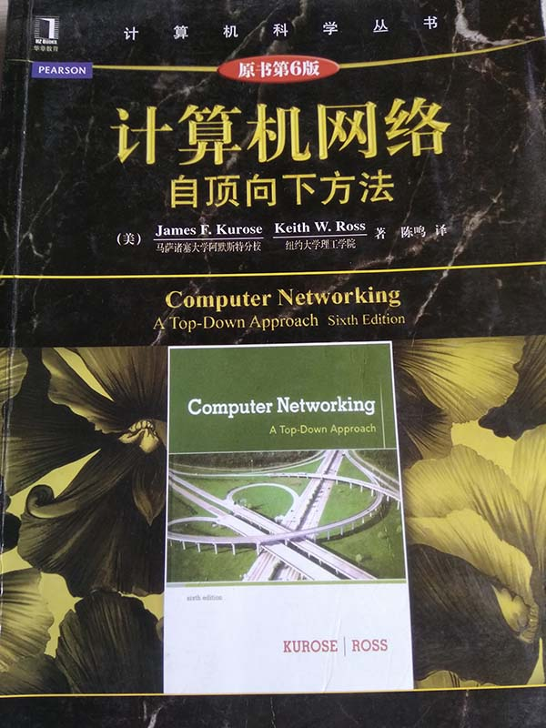

14. 数据结构	六成新	8元

    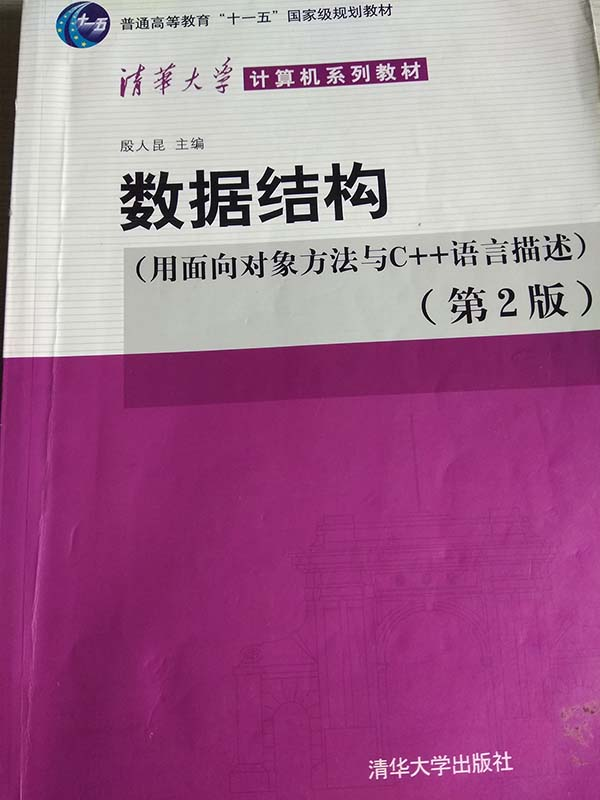

15. 操作系统教程	六成新	8元

    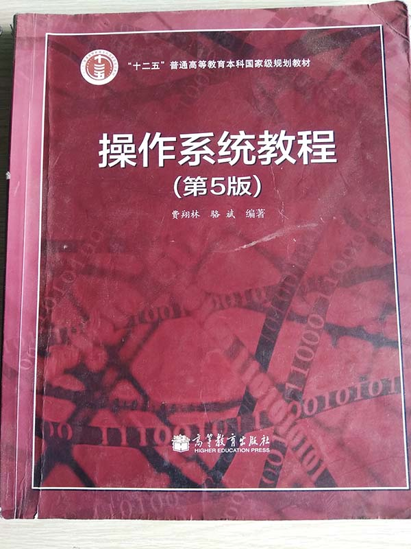

## 非专业相关书籍

1. 设计诗	八成新	20元

   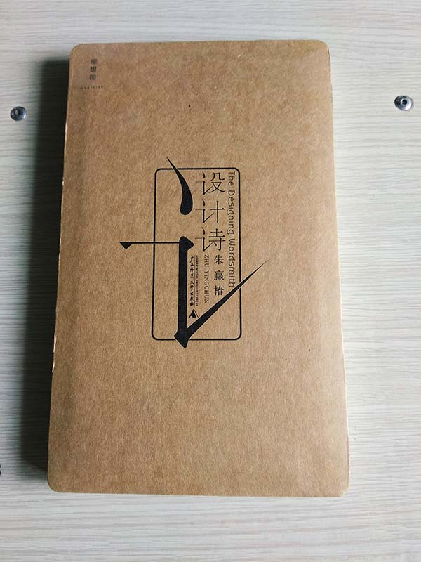

## 专业相关书籍

1. 编程珠玑	九成新	12元

   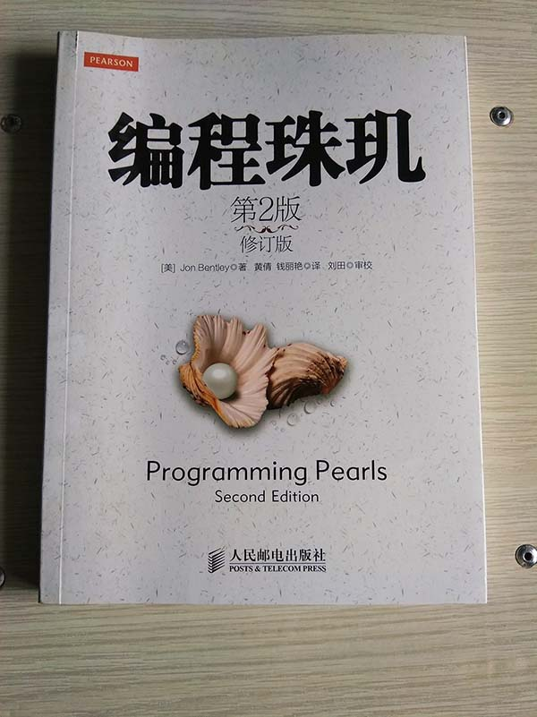

2. Java大学教程	九成新	10元

   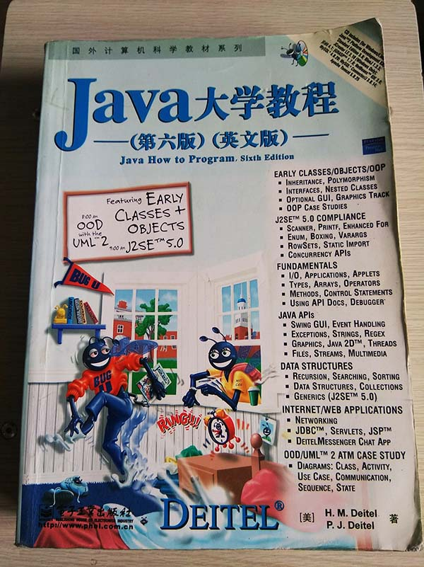

3. 模式分类	九成新	12元

   

4. 艾伦图灵传	八成新	8元

   

5. c++沉思录	七成新	8元

   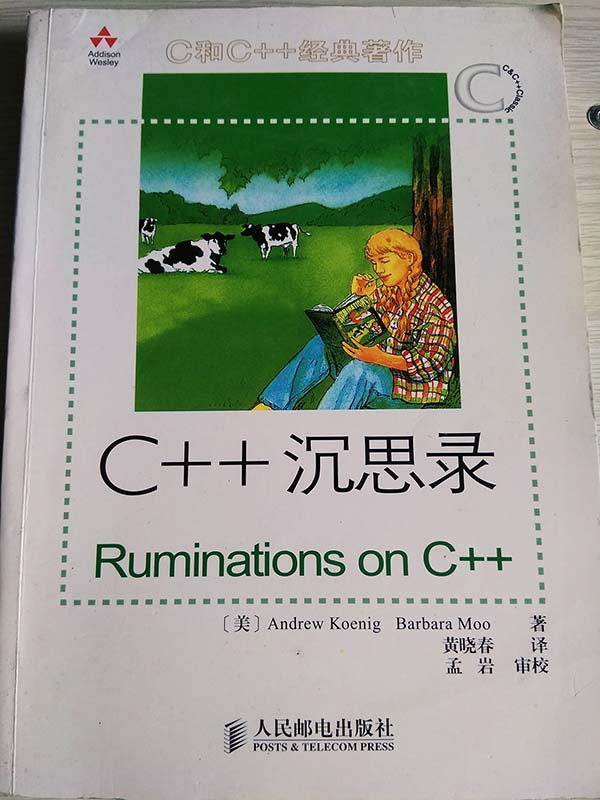

6. 数据库管理基础教程	全新	12元  (已出)

   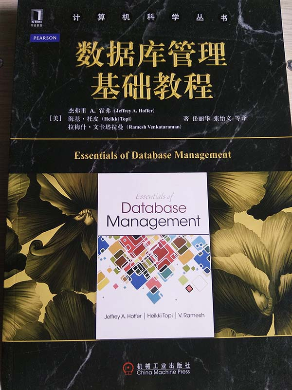

7. 数据科学与大数据技术导论	全新	12元

   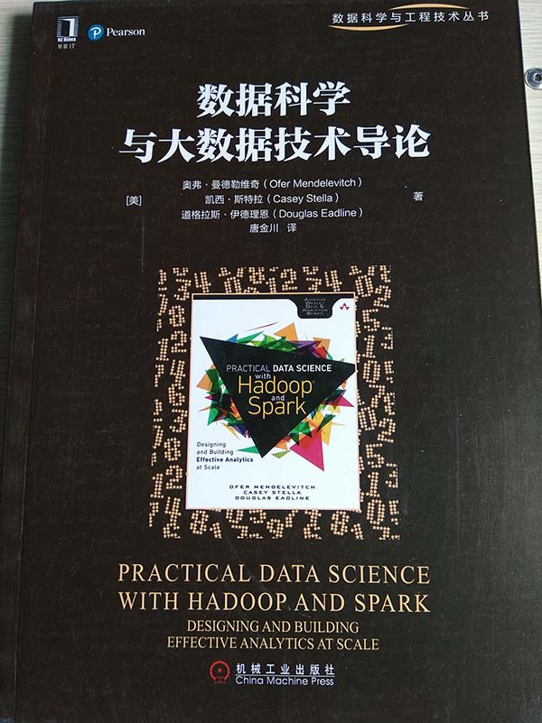

8. 高性能分布式计算系统开发与实现	未拆封	12元

   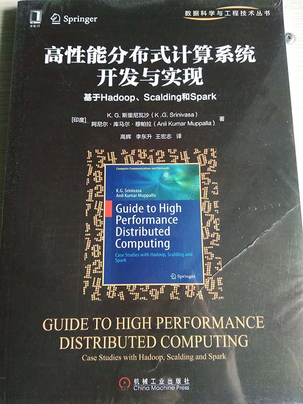

9. 分布式计算、云计算与大数据	全新	12元

   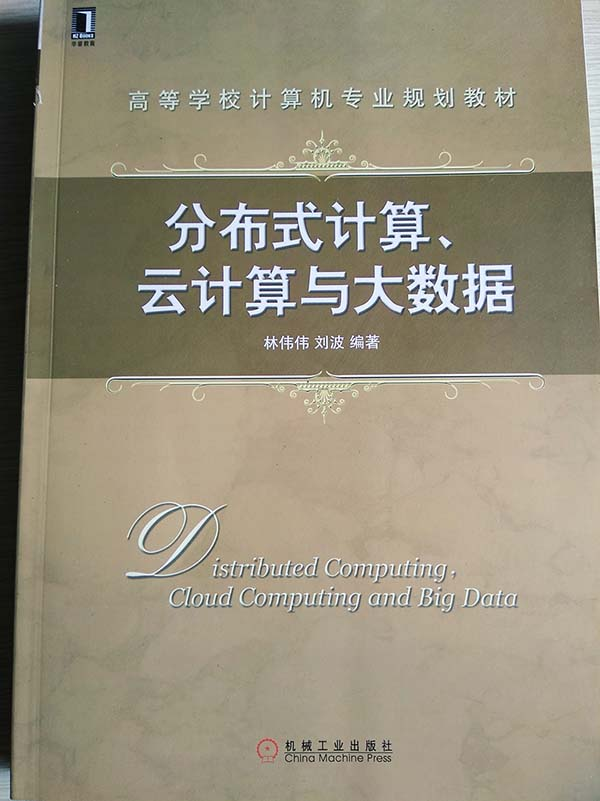

10. 云计算原理与实践	未拆封	12元

    

11. Java语言程序设计基础篇影印本	八成新	8元

    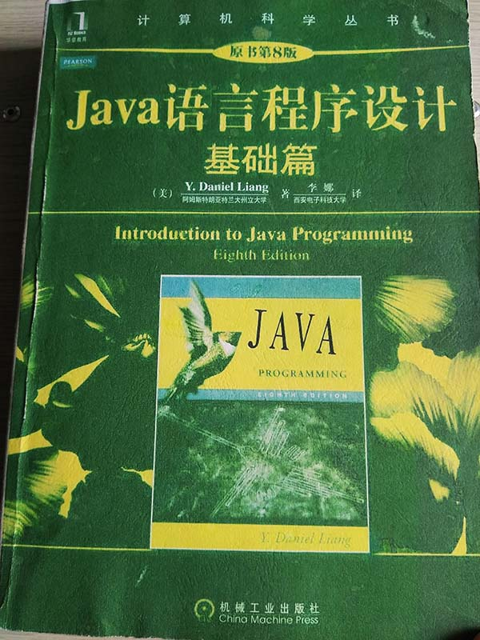

12. GRE逆序记忆小词典	八成新	8元

    

13. GRE官方考试指南	七成新	8元

    

14. GRE综合指导与全真考场	七成新	8元

    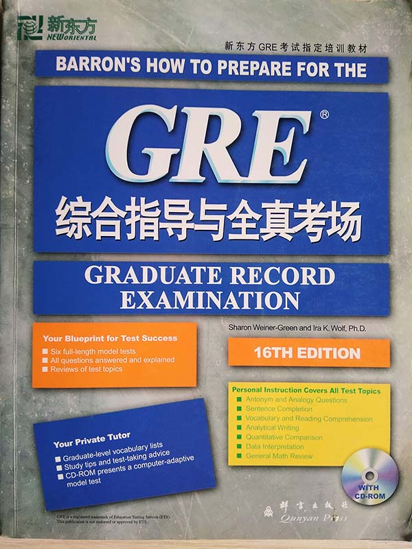

15. GRE阅读理解教程	六成新	8元

    

16. GRE填空教程	六成新	8元

    

17. GRE写作教程	六成新	8元

    

18. GRE数学教程	八成新	8元

    

